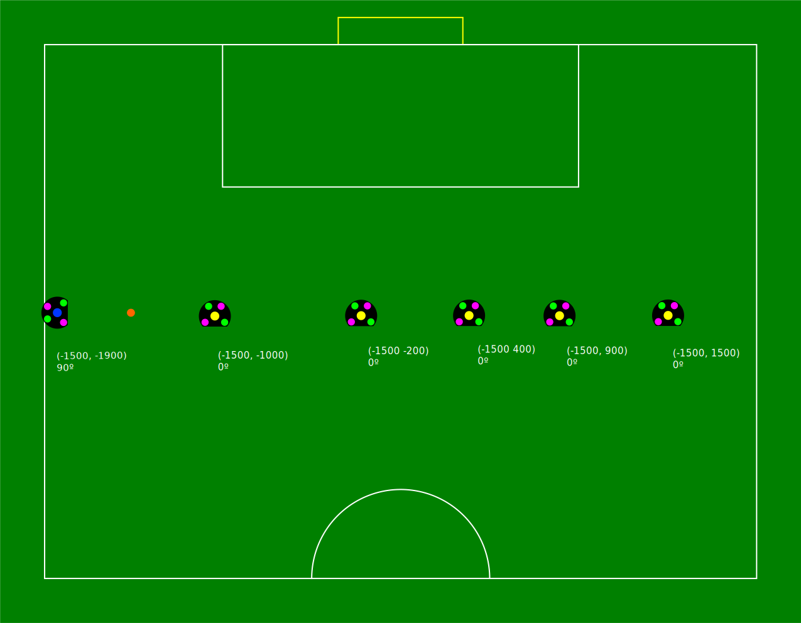

:source-highlighter: highlightjs
:icons: font

= RoboCup Small Size League (SSL) Hardware Challenges 2021
:toc:
:toclevels: 3

== Motivation

A key distinguishing characteristic of the Small Size League is its tight integration of software and hardware, which is crucial to success. A purely simulated tournament may reflect the best in software, but it excludes hardware development and omits hardware-software integration. To address this gap, the SSL hardware challenges outlined in this document will be conducted alongside the virtual SSL soccer tournament for RoboCup 2021. The rules for the SSL Hardware Challenges require significantly fewer resources than a full-size SSL field setup, and takes into account the constraints identified by the SSL teams.

== Constraints

For all hardware challenges, the following rules apply:

- All challenges will be playable on a field with 4x3m or larger.
- Human interference is not allowed unless specified otherwise.
- Normal division B rules apply, unless specified otherwise.
- Teams need to run an autoRef in their lab for rule checking and evaluation.
- The challenges will be performed live, using a video stream. Teams need to provide a camera that covers the whole field.

== Requirements

The following requirements need to be met by the teams:

* All software should ideally run on the same computer for easier validation and screen-shared in the video conference provided by the organizers.
* A view on the field should be streamed either to the video conference directly, or on a streaming platform like Youtube.
* Software to be installed on the team's computer:
- https://github.com/RoboCup-SSL/ssl-game-controller[Ssl-game-controller]
- https://github.com/TIGERs-Mannheim/AutoReferee[TIGERs autoRef]
- https://github.com/RoboCup-SSL/ssl-hardware-challenge-tool[ssl-hardware-challenge-tool]
- Optional: https://github.com/robotics-erlangen/autoref[ER-Force autoRef]
- Optional: Log recording tools, see https://ssl.robocup.org/league-software/[League Software]

== General Rules and Procedure

The general procedure for each team to perform all challenges is as follows:

* There will be two members of OC, TC and EC that will act as the supervisors of the challenges.
* The team has 2 hours to complete all four challenges.
* The team can decide to use the remaining time of the current time slot in the second time slot between each challenge.
* Challenges can not be repeated, nor span over both time slots.
* The second time slot can also be used if there are technical issues that the team has no influence on (like with video streaming or with league software).
* The supervisors will take note of the time that was not usable for the team and may allow the team to complete the remaining challenges on the second time slot, if there is no time left on the first one.
* The team must share the full screen of the computer that is performing the challenge so that everyone can validate what the team is doing.
* The team may not change any code or configuration during one challenge.
* If the team uses their software to initialize the scenario, it is allowed to touch their computer for that. This must be done in an understandable way, so that viewers can verify what the team is doing.
* The supervisors can disqualify a team after one warning, if they suspect that a team is actively manipulating their software during a challenge.
* The team is free to change their software between the four challenges.
* The team can take as much time as they want between challenges. The only limit is the 2h time slot. When the 2 hours are over, the current trial can be completed, but no new trials are allowed. All remaining challenges and trials are considered as failed.

NOTE: Teams should make sure that they can prepare all scenarios within a short time, as this preparation time
also counts towards their 2-hour time budget. So, moving robots to their target positions automatically is highly
encouraged.

== Evaluation

For each challenge, teams are ranked in order of performance.
The exact scoring depends on the challenge and is described in the individual sections.
The overall rank will be determined by the minimum sum of all four ranks.

In case of a tie, the scores (sum of relative times) of challenge 1 and 2 are added per team, and the team with the lower
score wins. If there is still a tie, the faster team of challenge 3 wins. Lastly, if that still leads to a tie, the
team with most passes in challenge 4 wins.

A member of OC/TC will be assigned to each challenge and act as the referee. The TC may provide a tool that helps with evaluation of the challenge. The referee has the final decision of the result.

== Challenges

There will be four independent challenges. Teams are not required to participate in all challenges, but skipping one challenge will have a significant impact on the final score.

=== Challenge 1: Scoring with static defenders

==== Objective

The objective of this challenge is to score a goal from a number of static situations as fast as possible. This will test the capabilities of the robots to score goals and play passes with static defenders as fast and precisely as possible.

==== Procedure

There will be ten different situations in random order that teams have to handle.
They are specified in the appendix <<Scenarios for Challenge 1>>.
The situations include the positions of the opponent robots and the ball.
For each situation, the team has three trials, out of which the best counts.

For each situation, the following procedure applies:

1. The team places up to *6* opponent robots and the ball according to the given situation.
2. Up to *3* robots of the team are placed on the middle line.
3. A STOP command will be issued for exactly *5s* to allow the team to prepare their robots.
4. Immediately afterwards, a *Normal Free Kick* command will be issued and the timer will start.
5. The team has *20s* to score a goal. Afterwards, the trial is over.
6. The timer is stopped when a valid goal is scored.

==== Rules

The following rules apply for this challenge:

- Normal Division B match rules apply. If the team performs a foul or the ball leaves the field, the trial is over and is counted with *20s*.
- No human interference is allowed during each trial.
- The opponent robots must be shaped like normal robots. A robot hull is sufficient, but it should stand stable.
- The goal must be *0.7m* wide. Teams should provide a visible goal with the correct dimensions to make evaluation easier.
- Teams need to calibrate ssl-vision for a half field with *3x4m*. This means, the full field would be *6x4m* (standard field size). The goal is on the 4m side. The actual field size can be larger, but the ball will be out of field, when leaving the ssl-vision-calibrated field (checked by an autoRef).
- The penalty area must be *0.8x2m* in size.

==== Evaluation

For each situation, the fastest time of each team is divided by the median over the fastest times per trial of all teams.
These ten scores are summed up. Based on the result, teams are ranked from low to high.

=== Challenge 2: Scoring from contested possession

==== Objective

In this challenge, the objective is to score a goal as fast as possible in a situation where a static defender is protecting the ball from its own goal while also touching the ball. A single attacker needs to get the ball into possession without pushing the defender, get it around the defender and score a goal.

==== Procedure

There will be five different situations in random order that teams have to handle. They are specified in the appendix <<Scenarios for Challenge 2>>. The situations include the positions of the opponent robots.
The ball is touching the defenders dribbler.
The attacker is placed in front of the ball, exactly opposite of the defender.
The distance between the ball center and the attacking robot center must be 0.3 m.
For each situation, the team has three trials, out of which the best counts.

For each situation, the following procedure applies:

- The team places the defender, the ball and the attacker according to the given situation.
- A *FORCE START* command will be issued and the timer will start.
- The attacker has *30s* to score a goal. Afterwards, the trial is over.
- The timer is stopped when a valid goal is scored.

==== Rules

The following rules apply for this challenge:

- Normal Division B match rules apply. If the team performs a foul or the ball leaves the field, the trial is over and is counted with *30s*.
- No human interference is allowed during each trial.
- The opponent robot must be a real robot, but it does not need to be able to move.
- The opponent robot may actively hold its position.
- The goal must be *0.7m* wide. Teams should provide a visible goal with the correct dimensions to make evaluation easier.
- Teams need to calibrate ssl-vision for a half field with *3x4m*. This means, the full field would be *6x4m* (standard field size). The goal is on the 4m side. The actual field size can be larger, but the ball will be out of field, when leaving the ssl-vision-calibrated field (checked by an autoRef).
- The penalty area must be *0.8x2m* in size.

==== Evaluation

For each situation, the fastest time of each team is divided by the median over the fastest times per trial of all teams.
These five scores are summed up. Based on the result, teams are ranked from low to high.

=== Challenge 3: Dribbling

==== Objective

To test the dribbling capabilities of the team, one robot of the team must navigate through a field with static opponents, while keeping the ball. The goal of the challenge is to complete the parcours within the minimum time. The timing will start as soon as the robot starts to move.

==== Procedure

The team has *three trials* to complete a predefined parkour. The procedure for each trial is as follows:

- A *FORCE_START* command will be issued and the timer will start.
- The team has *2 min* to finish the parkour. Afterwards, the trial is over.
- If the robot has finished the parkour and came to a complete stop, the timer is stopped.

The parkour will look like this:

.Here are the positions encoded as JSON:
[%collapsible]
====
[source,json]
----
include::scenarios-challenge-3/hwc3.json[]
----
====

The parkour is to be interpreted as follows:

- The robots and the ball will stand on a straight line, as defined in the image.
- The absolute positions of the robot can be changed if needed as long as the relative distances are still the same.
- The robot ids can be interchanged arbitrarily, as long as they are unique.
- Each pair of two neighboring yellow robots form a gate.
- Each gate needs to be crossed in any direction.
- A gate is crossed, if the ball fully crossed the line between the two robot centers.
- The gates need to be crossed from closest to farthest.
- The last gate needs to be crossed three times.

This is an example of how a robot may navigate through the parkour:

==== Rules

The following rules apply in this challenge:

- The standard match rules do not apply. This means:
* The robot is allowed to dribble the ball for more than 1m in this challenge.
* The ball can not go out of the field.

- If the robot loses the ball, the robot is allowed to retrieve the ball again and continue. The time will not be paused.
- The robot is not allowed to touch the obstacles, else the trial is considered failed.
- Teams are allowed to limit their field to 3x4m, but they don’t have to.

==== Evaluation

The fastest trial per team is taken for overall scoring.

The number of crossed gates will be used as a tiebreaker, if multiple teams have failed all trials.

=== Challenge 4: Pass endurance

==== Objective

This challenge focuses on pass endurance and efficiency of robots. For best results, a team must be able to kick and receive the ball precisely, fast and often. This is not only challenging for the software, but also for the mechanics of the robot.

Within a limited time, the team is asked to perform as many passes as possible. The team that performed the most passes wins.

==== Procedure

- The team places all robots on the middle line and the ball on the center point.
- A FORCE_START command will be issued and the timer will start.
- After *5min* a HALT command will be issued and the challenge is over.

.Here are the positions encoded as JSON:
[%collapsible]
====
[source,json]
----
include::scenarios-challenge-4/hwc4.json[]
----
====

==== Rules

Teams are free in how they perform the passes. Definitions of a pass in general and additional constrains for valid
pass that are considered in the scoring are given in this section.

A pass is defined as follows:

- A pass has a source position, a target position and a shooter.
- The source position is where the ball was kicked by a robot.
- The target position is where the ball either stops or changes direction by more than 30 degrees.
- The shooter is the robot located nearest to the source position when the pass started.
- The pass distance is the euclidean distance between source and target position.
- The pass direction is the orientation of the vector of `target - source`.

A valid pass must additionally met the following constraints:

- The pass distance must be at least *1.5m*.
- The shooter of the previous pass can not be the receiver of the current pass (this implicitly means you need *at least 3 robots*).
- The pass direction of the pass must differ by at least *10 degrees* from the inverted previous pass direction: latexmath:[abs(passDirection_{cur} - (passDirection_{previous} + 180°)) > 10°]
- The ball must not exceed 6.5 m/s (as defined in the tournament rules).

NOTE: Previous passes include all passes, not only those considered valid.

Additionally, the following rules apply:

- The number of robots is limited to *6 robots*.
- The minimum field size is *4x3m*, but teams are allowed to play on a larger field if they wish to do so.
- Teams are allowed and encouraged to recover the ball from the field boundary.
- Any human interference, including exchanging robots, reduces the final number of passes by *10*.

==== Evaluation

The team with most valid passes wins. If teams have the same number of passes, they will share the better position.

[appendix]

== Scenarios for Challenge 1

include::scenarios-challenge-1.adoc[]

[appendix]

== Scenarios for Challenge 2

include::scenarios-challenge-2.adoc[]
