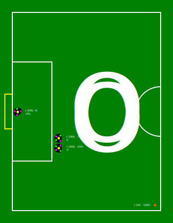
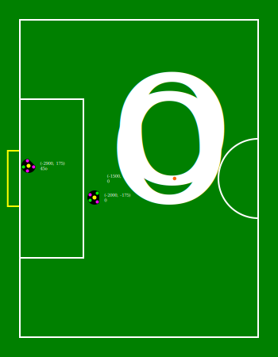
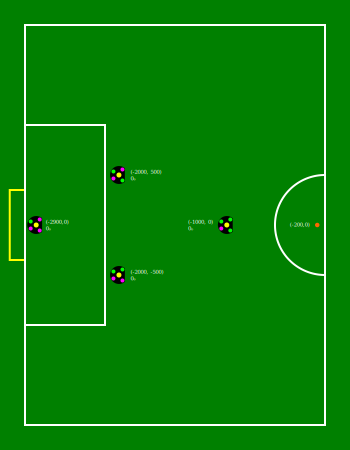
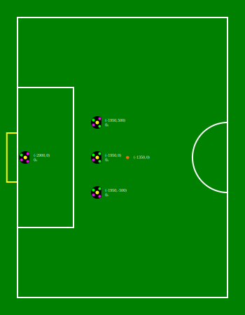
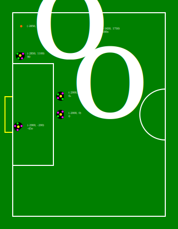
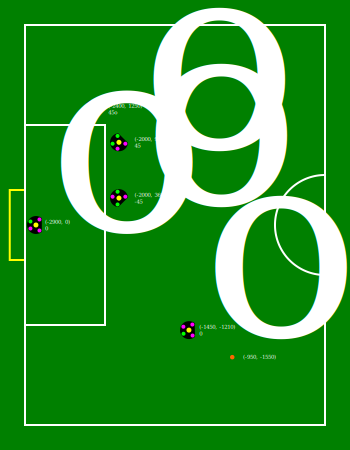
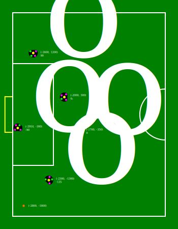
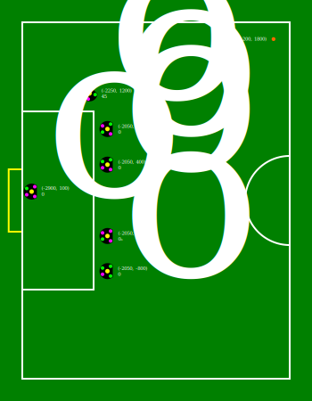
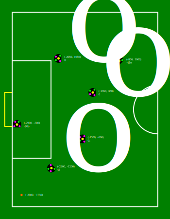
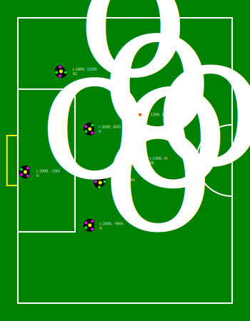

=== Scenario 1
Amount of opponents: 3 +
Difficulty level: 1 +
Description: Free kick far from the goal with two defenders and a goalkeeper. +

[source,json]
----
{"ball":{"pos":[-200,-1800,0]},"bots":[{"obj":{"pos":[-2900,0,-0.785398]},"id":{"number":0,"color":"YELLOW"}},{"obj":{"pos":[-2000,-750,0]},"id":{"number":1,"color":"YELLOW"}},{"obj":{"pos":[-2000,-550,0]},"id":{"number":2,"color":"YELLOW"}}]}
----

=== Scenario 2
Amount of opponents: 3 +
Difficulty level: 1 +
Description: Free kick on the middle line with two defenders and a goalkeeper. +

[source,json]
----
{"ball":{"pos":[-900,0,0]},"bots":[{"obj":{"pos":[-2900,175,0.785398]},"id":{"number":0,"color":"YELLOW"}},{"obj":{"pos":[-2000,-175,0]},"id":{"number":1,"color":"YELLOW"}},{"obj":{"pos":[-1500,0,0]},"id":{"number":2,"color":"YELLOW"}}]}
----

=== Scenario 3
Amount of opponents: 4 +
Difficulty level: 1 +
Description: Free kick from the center of the field with three opponents and a goalkeeper. +

[source,json]
----
{"ball":{"pos":[-200,0,0]},"bots":[{"obj":{"pos":[-2900,0,0]},"id":{"number":0,"color":"YELLOW"}},{"obj":{"pos":[-2000,500,0]},"id":{"number":1,"color":"YELLOW"}},{"obj":{"pos":[-2000,-500,0]},"id":{"number":2,"color":"YELLOW"}},{"obj":{"pos":[-1000,0,0]},"id":{"number":3,"color":"YELLOW"}}]}
----

=== Scenario 4
Amount of opponents: 4 +
Difficulty level: 2 +
Description: Free kick from the middle line with three opponents and a goalkeeper. +

[source,json]
----
{"ball":{"pos":[-1350,0,0]},"bots":[{"obj":{"pos":[-2900,0,0]},"id":{"number":0,"color":"YELLOW"}},{"obj":{"pos":[-1950,500,0]},"id":{"number":1,"color":"YELLOW"}},{"obj":{"pos":[-1950,0,0]},"id":{"number":2,"color":"YELLOW"}},{"obj":{"pos":[-1950,-500,0]},"id":{"number":3,"color":"YELLOW"}}]}
----

=== Scenario 5
Amount of opponents: 5 +
Difficulty level: 3 +
Description: Free kick from the top-left part of the field with 4 opponents and a goalkeeper. +

[source,json]
----
{"ball":{"pos":[-2850,1750,0]},"bots":[{"obj":{"pos":[-2900,-200,-0.785398]},"id":{"number":0,"color":"YELLOW"}},{"obj":{"pos":[-2850,1100,1.5708]},"id":{"number":1,"color":"YELLOW"}},{"obj":{"pos":[-2000,500,0]},"id":{"number":2,"color":"YELLOW"}},{"obj":{"pos":[-2000,0,0]},"id":{"number":3,"color":"YELLOW"}},{"obj":{"pos":[-1450,1750,3.14]},"id":{"number":4,"color":"YELLOW"}}]}
----

=== Scenario 6
Amount of opponents: 5 +
Difficulty level: 2 +
Description: Free kick from the bottom-right part of the field with four opponents and a goalkeeper. +

[source,json]
----
{"ball":{"pos":[-950,-1550,0]},"bots":[{"obj":{"pos":[-2900,0,0]},"id":{"number":0,"color":"YELLOW"}},{"obj":{"pos":[-2000,950,0.785398]},"id":{"number":1,"color":"YELLOW"}},{"obj":{"pos":[-2400,1250,0.785398]},"id":{"number":2,"color":"YELLOW"}},{"obj":{"pos":[-2000,360,-0.785398]},"id":{"number":3,"color":"YELLOW"}},{"obj":{"pos":[-1450,-1210,0]},"id":{"number":4,"color":"YELLOW"}}]}
----

=== Scenario 7
Amount of opponents: 5 +
Difficulty level: 3 +
Description: Free kick from the bottom-left part of the field with four opponents and a goalkeeper. +

[source,json]
----
{"ball":{"pos":[-2800,-1800,0]},"bots":[{"obj":{"pos":[-2910,-300,-1.571]},"id":{"number":0,"color":"YELLOW"}},{"obj":{"pos":[-2600,1200,1.571]},"id":{"number":1,"color":"YELLOW"}},{"obj":{"pos":[-1700,-350,0]},"id":{"number":2,"color":"YELLOW"}},{"obj":{"pos":[-2300,-1300,-2.356]},"id":{"number":3,"color":"YELLOW"}},{"obj":{"pos":[-2000,300,0]},"id":{"number":4,"color":"YELLOW"}}]}
----

=== Scenario 8
Amount of opponents: 6 +
Difficulty level: 3 +
Description: Free kick from the top-right corner with five opponents and a goalkeeper. +

[source,json]
----
{"ball":{"pos":[-200,1800,0]},"bots":[{"obj":{"pos":[-2900,100,0]},"id":{"number":0,"color":"YELLOW"}},{"obj":{"pos":[-2250,1200,0.785]},"id":{"number":1,"color":"YELLOW"}},{"obj":{"pos":[-2050,800,0]},"id":{"number":2,"color":"YELLOW"}},{"obj":{"pos":[-2050,400,0]},"id":{"number":3,"color":"YELLOW"}},{"obj":{"pos":[-2050,-400,0]},"id":{"number":4,"color":"YELLOW"}},{"obj":{"pos":[-2050,-800,0]},"id":{"number":5,"color":"YELLOW"}}]}
----

=== Scenario 9
Amount of opponents: 6 +
Difficulty level: 3 +
Description: Free kick from the bottom-left part of the field with five opponents and a goalkeeper. +

[source,json]
----
{"ball":{"pos":[-2800,-1750,0]},"bots":[{"obj":{"pos":[-2910,-300,-1.571]},"id":{"number":0,"color":"YELLOW"}},{"obj":{"pos":[-2050,1050,0]},"id":{"number":1,"color":"YELLOW"}},{"obj":{"pos":[-800,1000,-0.785]},"id":{"number":2,"color":"YELLOW"}},{"obj":{"pos":[-1350,350,0]},"id":{"number":3,"color":"YELLOW"}},{"obj":{"pos":[-1550,-600,0]},"id":{"number":4,"color":"YELLOW"}},{"obj":{"pos":[-2200,-1200,0.785]},"id":{"number":5,"color":"YELLOW"}}]}
----

=== Scenario 10
Amount of opponents: 6 +
Difficulty level: 2 +
Description: Free kick from within the field with five opponents and a goalkeeper. +

[source,json]
----
{"ball":{"pos":[-1300,650,0]},"bots":[{"obj":{"pos":[-2900,-150,0]},"id":{"number":0,"color":"YELLOW"}},{"obj":{"pos":[-2400,1250,0.785]},"id":{"number":1,"color":"YELLOW"}},{"obj":{"pos":[-2000,450,0]},"id":{"number":2,"color":"YELLOW"}},{"obj":{"pos":[-1300,0,1.571]},"id":{"number":3,"color":"YELLOW"}},{"obj":{"pos":[-1850,-300,-0.785]},"id":{"number":4,"color":"YELLOW"}},{"obj":{"pos":[-2000,-900,0]},"id":{"number":5,"color":"YELLOW"}}]}
----

